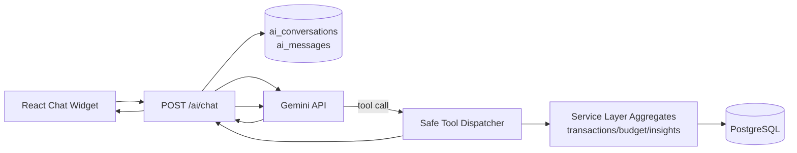

# AI Assistant Agent (`/ai/chat`)

## Overview

The AI Financial Assistant uses Gemini with backend tool-calling to answer user questions and perform safe write actions.

## Quick Flow (Brief)

1. Frontend sends `POST /ai/chat` with `message` (+ optional `conversation_id`).
2. Backend validates JWT and loads short memory context from Postgres.
3. Gemini receives the prompt + allowed tool definitions.
4. If Gemini calls a tool, backend validates arguments and runs safe service logic.
5. Tool result is saved as a compact `tool` message, then Gemini is called again for final wording.
6. Backend returns `reply`, `conversation_id`, and `actions` for UI display.

Key properties:

- authenticated per-user scope
- no model-generated SQL
- validated tool arguments via Pydantic
- compact aggregate data only (token-efficient)
- Postgres conversation memory (summary + recent messages)

## Architecture



## Endpoint

### `POST /ai/chat`

Auth: `Bearer <access_token>`

Request:

```json
{
  "message": "Summarize my spending from 2026-02-01 to 2026-02-20",
  "conversation_id": null
}
```

Response:

```json
{
  "reply": "Your spending in that period was ...",
  "conversation_id": "77f4565e-2401-4f9d-a4e5-f0a16a7f8a4c",
  "actions": [
    {
      "tool": "get_summary",
      "kind": "read",
      "summary": "Range summary 2026-02-01 to 2026-02-20 ..."
    }
  ],
  "needs_confirmation": false
}
```

## Tool Catalog

Write tools:

- `create_transaction`
- `apply_budget_plan`

Read/simulation tools:

- `get_summary`
- `suggest_budget`
- `compare_category_trend`
- `simulate_budget_change`
- `get_financial_health_snapshot`
- `project_future`
- `get_fixed_variable_breakdown`
- `detect_anomalies`
- `plan_savings_goal`

## Safety Rules

- Every tool is user-scoped by `user_id` from JWT.
- Tool args are validated by Pydantic before execution.
- Write tools support `dry_run` preview mode.
- Model can only call declared tools; it cannot execute SQL.

## Token Efficiency Policy

- Conversation context sent to Gemini:
  - summary of older turns
  - last 6 messages only
- Tool outputs are compact and aggregated.
- Hard caps:
  - top categories <= 10
  - daily points <= 31
  - lookback months <= 12

## Conversation Memory

Tables:

- `ai_conversations`
- `ai_messages`

Behavior:

- appends user/assistant/tool messages
- when history exceeds threshold, older messages are deterministically summarized
- keeps recent 6 raw messages for short-term context

## Environment Variables

- `GEMINI_API_KEY` (required for `/ai/chat`)
- `GEMINI_MODEL` (optional override, defaults from app settings)

If `GEMINI_API_KEY` is missing, `/ai/chat` returns `503` with a friendly error.

## Files

- Router: `backend/app/ai/router.py`
- Gemini client: `backend/app/ai/gemini_client.py`
- Tool schemas/dispatcher: `backend/app/ai/tools.py`
- Prompt: `backend/app/ai/prompt.py`
- Memory store: `backend/app/ai/memory.py`
- Tool services:
  - `backend/app/services/transactions_service.py`
  - `backend/app/services/budget_service.py`
  - `backend/app/services/insights_service.py`
